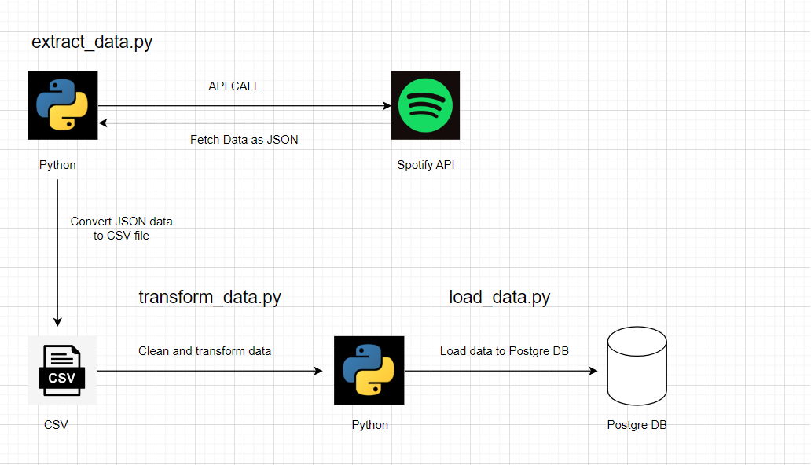

<h1>Pipeline Flowchart</h1>

<h1>How the Pipeline Works</h1>

ETL (Extract-Transform-Load) pipeline was designed using Spotify Web API. In the extract_data.py script, the data of the AC/DC music group is extracted as JSON using the Spotify API. Then this data was converted to CSV file using Pandas.

In the transform_data.py script, the data is cleaned and the transformation is done.

In the load_data.py script, the database table is created and the data is loaded into the PostgreSQL database.

<a href ="https://developer.spotify.com/documentation/web-api/reference/#/operations/get-several-audio-features" target="_blank">Web API Reference</a>

<a href = "https://www.kaggle.com/onurbagci3/datasets" target="_blank">Dataset</a>